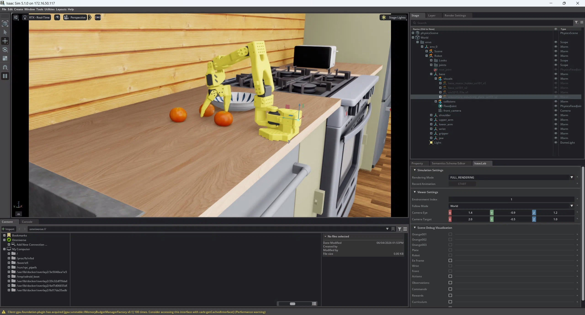
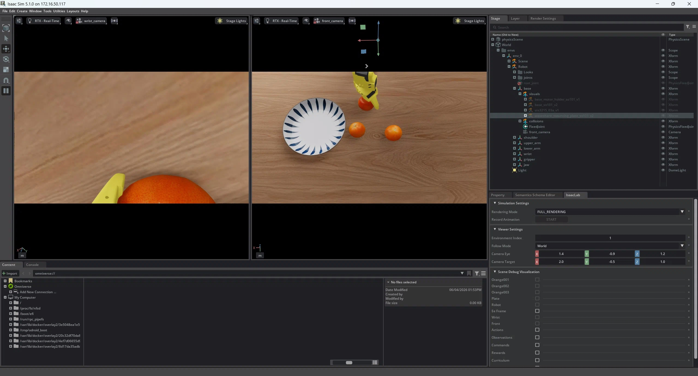

# pick_orange Pi 0.5 SFT 实验报告

**版本**: v1.0
**日期**: 2026-06-04
**作者**: 实验环境 = `lerobot-rlinf` 工作树（branch `develop`）
**实验范围**: SFT 阶段全过程 + 评估方法论 + closed-loop / HL state-machine 短期补救探测
**配套深度分析**: [`phase2_pickorange_sft_chain_collapse.md`](./phase2_pickorange_sft_chain_collapse.md)

---

## 一、实验环境

### 1.1 硬件 / 软件栈


| 项                       | 值                                                                                                                                       |
| -------------------------- | ------------------------------------------------------------------------------------------------------------------------------------------ |
| GPU                      | 1× （24 GB；评估期间 PaliGemma 推理峰值 ~12 GB，因此并发上限 num_envs=2）                                                               |
| 训练 conda env           | `rlinf-lerobot-train`（lerobot 主线 + Pi 0.5 后端）                                                                                      |
| 评估 conda env           | `rlinf-isaacsim-env`（Isaac Lab 4.5 + LeIsaac SO-101）                                                                                   |
| 仿真器                   | Isaac Sim 4.5 + Isaac Lab + LeIsaac 子模块（`third_party/leisaac`，pinned）                                                              |
| 控制周期                 | 0.02 s（50 Hz）                                                                                                                          |
| **模型基座（SFT init）** | **`lerobot/pi05_base`**（HuggingFace Hub；snapshot `9e55186ad36e66b95cda57bc47818d9e6237ae30`）                                          |
| 基座架构                 | PaliGemma 2B（vision + language）+ 300 M Gemma action expert（流匹配）                                                                   |
| 基座 input 槽位          | 5 cam slots（base_0_rgb, left_wrist_0_rgb, right_wrist_0_rgb, empty_camera_0/1）+ state(32)；本任务用 2 路真实相机 + 1 路 empty 自动 pad |
| 训练启动脚本             | `scripts/sft_pi05_pickorange.sh`（`--policy.path=lerobot/pi05_base`）                                                                    |
| 模型权重格式             | lerobot 原生`pretrained_model/` 目录（`model.safetensors` + `preprocessor` + `postprocessor`）                                           |
| 评估脚本                 | `scripts/eval_pi05_pickorange_lerobot.py`（lerobot-native PI05Policy 路径，绕开 openpi 适配层）                                          |

### 1.2 任务定义



- **Env**: `LeIsaac-SO101-PickOrange-v0`
- **任务剧本**: 桌面有 3 颗橘子 + 1 个盘子；SO-101 6-DoF 单臂（含夹爪）将 3 颗橘子依次放入盘子并回到 rest pose
- **success DoneTerm**: 3 颗橘子同时进盘 ±(0.10, 0.10, 0.07) 容差 **AND** `is_so101_at_rest_pose(joint_pos)` 同时为真。任一橘子掉出或末位未回 rest 都算 fail
- **time_out**: 30 s（1500 个 0.02 s 步）
- **subtask_terms 观测群**: 每 step 提供 `pick_orange00N`、`put_orange00N_to_plate`（N=1,2,3）布尔标记，**仅用于评估侧 staged 诊断和 HL 状态机**，模型本身不消费

### 1.3 数据集

- **来源**: `LightwheelAI/leisaac-pick-orange`（HuggingFace LeRobot 数据集；原始 v2.1 格式 → 用 `lerobot.datasets.v30.convert_dataset_v21_to_v30` 本地转 v3.0 训练）
- **规模**: 60 集成功 demo（HuggingFace 公布；总时长约 20 min）
  
- **观测**:
  - 2 路 RGB 相机：front（base 视角）、wrist（腕载视角），480×640 → 训练时 resize 224×224
  - 6-DoF joint position（motor-degree 单位）
- **动作**: 6-DoF target joint position（motor-degree 单位）
- **language prompt**: **整个数据集只有 1 条 task 字符串 `"Grab orange and place into plate"`**（验证自 `tasks.jsonl`）

### 1.4 评估指标定义


| 名称                      | 定义                                                     | 备注                                                  |
| --------------------------- | ---------------------------------------------------------- | ------------------------------------------------------- |
| **per-orange place rate** | `total_placed / (episodes × 3)`                         | 历史 orchestrator 口径，**橘子粒度**而非 episode 粒度 |
| **full-task SR**          | `succ_count / episodes`，其中 `succ = term & ~trunc`     | env DoneTerm 真值，**这次报告的"真任务成功率"**       |
| ever pick_i / place_i     | episode 内 subtask_terms 是否曾置真                      | per-orange 链断诊断                                   |
| ever all3_simul           | episode 内是否曾`place_1 ∧ place_2 ∧ place_3` 同步为真 | 区分"曾全部放上"和"放上又掉"                          |
| P(X\| Y) 条件存活率       | episode 间的累计概率                                     | 定位链断点                                            |

**关键纠正**：早期 orchestrator 的 `eval_results.tsv` 写的"SR 33% / 43% / 45%"是 per-orange place rate，**不是任务成功率**。本报告所有"SR"默认指 full-task SR（env DoneTerm 口径），并对历史值统一重新核算。

---

## 二、实验前提（先决假设和已知约束）

### 2.1 训练配置（来自 `train_config.json`，已落盘可查）


| 配置                            | 值                                                                                   | 说明                                                                     |
| --------------------------------- | -------------------------------------------------------------------------------------- | -------------------------------------------------------------------------- |
| **`policy.path` (init)**        | **`lerobot/pi05_base`**                                                              | HF Hub 公开 Pi 0.5 base 权重，作为 SFT 起点                              |
| `policy.type`                   | `pi05`                                                                               | lerobot 原生 Pi 0.5（OpenPI 直接 port）                                  |
| `paligemma_variant`             | `gemma_2b`                                                                           | 视觉 + 语言编码器                                                        |
| `action_expert_variant`         | `gemma_300m`                                                                         | 流匹配动作专家                                                           |
| `dtype`                         | `bfloat16`                                                                           |                                                                          |
| `chunk_size` / `n_action_steps` | 50 / 50                                                                              | 默认完全开环（一次推理执行 50 步 = 1 s）                                 |
| `num_inference_steps`           | 10                                                                                   | 流匹配采样步数                                                           |
| `freeze_vision_encoder`         | true                                                                                 | 仅训 action expert（节省显存 + 防 vision 偏移）                          |
| `train_expert_only`             | true                                                                                 | 同上                                                                     |
| **`normalization_mapping`**     | STATE/ACTION =**QUANTILES**, VISUAL = IDENTITY                                       | quantile 反演评估时必须用同份 norm_stats（已验证一致）                   |
| optimizer                       | AdamW (lr=2.5e-5, β=(0.9, 0.95), wd=0.01, grad_clip=1.0)                            |                                                                          |
| scheduler                       | cosine_decay_with_warmup（warmup 1000, decay 30000, peak→decay = 2.5e-5 → 2.5e-6） |                                                                          |
| `batch_size`                    | 8                                                                                    | 单 GPU 训练                                                              |
| `steps`                         | 40000                                                                                | 实际跑到 34000（见 §3）                                                 |
| `save_freq`                     | 2000                                                                                 | 评估按 2000-step 粒度                                                    |
| `image_transforms.enable`       | false                                                                                | 没开图像增广（保留作为后续改进抓手）                                     |
| `use_imagenet_stats`            | true                                                                                 | RGB 归一化复用 ImageNet 统计                                             |
| `rename_map`                    | `front → base_0_rgb`, `wrist → right_wrist_0_rgb`                                  | 数据集 2 路相机映射到 Pi 0.5 标准 5 路 input slots（剩余 3 路 auto-pad） |
| `empty_cameras`                 | 1                                                                                    | 自动填充 1 个 empty_camera_0                                             |

### 2.2 已知约束 / 风险

1. **数据量极小**: 60 demo × 单 prompt → 语言条件维度被压缩成 1 个 token；任何 OOD prompt 替换风险高。
2. **没有图像增广**: 训练侧像素分布与 Isaac Sim 渲染像素分布存在 sim-2-real 风险（虽都在仿真）。
3. **freeze vision**: 视觉编码器无法从 demo 中学新东西，依赖 PaliGemma 预训练泛化。
4. **开环 chunk_size=50**: 推理 1 次执行 1 s 动作，对动态扰动（橘子滚动、掉盘）补偿弱。
5. **subtask_terms 在 auto-reset 后被清零**: env 成功瞬间立即 reset，sticky-OR `ever_all3_simul_and_rest` 抓不到真值 → 仅作 lower-bound 参考；authoritative 仍是 `succ`。
6. **success criterion 包含 parking**: env DoneTerm 严格要求 arm 回 rest pose，第三颗放完后还不能松手；纯"3 橘上盘"≠ 成功。

---

## 三、实验设计

### 3.1 实验 A：SFT 收敛曲线（checkpoint 时间序列）

- **目的**: 找到 SR 饱和点 / 决定何时停训
- **设计**: 在 2K-34K 每 2000 步保存 ckpt，orchestrator 在 28K/30K/32K/34K 做 60 eps eval
- **粒度**: 评估口径为 per-orange place rate（历史口径）
- **早停依据**: loss 在 ~0.05 平台期，per-orange rate 在 34K 达到 45.0% 后无明显进一步上升（结合显存和时间预算，决定停在 34K 做更精细评估）

### 3.2 实验 B：n_action_steps 单变量轴扫描

- **目的**: 拆解链式坍塌是 open-loop drift 还是单段能力不足
- **变量**: `policy.config.n_action_steps`：50（训练同款，纯开环 1 s）→ 10（每 0.2 s 重做 obs 输入，**仅推理阶段改**，权重不动）
- **理论模型**: 链式独立模型
  ```
  P(success) ≈ P(grasp≥1) · P(place≥2|≥1) · P(place=3|≥2) · P(all3_simul|place=3) · P(success|all3_simul)
  ```
- **设计**: 同 34K ckpt，60 eps，固定 seed=1000，仅 `--n-action-steps` 不同；新增 staged 统计（per-orange、cumulative、conditional）

### 3.3 实验 C：HL state-machine（per-stage prompt switching）

- **目的**: 用手编"高层策略"零样本补 chain decay 和 parking
- **设计 C0（早期，未完成）**: placed=3 单点切 prompt 到 `"Move robot arm back to rest position"`，其他状态保持训练原 prompt → 中途被改成 C1
- **设计 C1（4-stage）**: 按 placed 计数动态切换 4 个 prompt
  ```
  placed=0 → "Pick up the first orange and place it on the plate"
  placed=1 → "Pick up the second orange and place it on the plate"
  placed=2 → "Pick up the third orange and place it on the plate"
  placed=3 → "Move robot arm back to rest position"
  ```
- **已知 OOD 风险**: 4/4 prompt 全部从未见过；预期效果"不可预期"，跑实验做净效应验证
- **仪表化**: rising-edge log 每次 placed 计数前进时打印 `[HL] ep=X env=Y step=S placed P→N prompt='...'`

### 3.4 实验 D：n=10 baseline 复现

- **触发**: HL-4 出现严重退化，需排除"原 n=10 baseline 偏运气"
- **设计**: 同 34K ckpt + n_action_steps=10 + no HL，**30 eps**（半数），seed=1000
- **判定标准**: 复现 = full-task SR、ever_all3_simul、P(success\|all3_simul) 三个核心数字落在原 60 eps 数据合理波动内

---

## 四、实验对比

### 4.1 实验 A 结果（per-orange place rate vs 训练步数）


| step   | per-orange place   | 备注                         |
| -------- | -------------------- | ------------------------------ |
| 2K-28K | 0%                 | 单 eps 抽样 4 集，统计噪声大 |
| 30K    | 20 / 60 = 33.3%    | 首次成型                     |
| 32K    | 26 / 60 = 43.3%    | +10 pp                       |
| 34K    | 27 / 60 =**45.0%** | +1.7 pp，**饱和**            |

**结论 A**: 30K → 34K 已进入 diminishing returns；34K 之后继续训不能突破 50% per-orange 上限。

### 4.2 实验 B 结果（n_action_steps：50 vs 10 vs 1-stage HL placeholder vs 4-stage HL）

**全部基于 34K ckpt，60 eps × 2 envs × 1500 steps**


| 指标                  | n=50 baseline  | n=10 baseline   | n=10 + HL-4                     |
| ----------------------- | ---------------- | ----------------- | --------------------------------- |
| **full-task SR**      | 4/60 =**6.7%** | 6/60 =**10.0%** | 3/60 =**5.0%**                  |
| per-orange place rate | 30.0%          | 49.4%           | 32.8%                           |
| O1 grasp ever         | 21.7%          | **40.0%**       | **11.7%**                       |
| O2 grasp ever         | 41.7%          | 61.7%           | 40.0%                           |
| O3 grasp ever         | 45.0%          | 65.0%           | 48.3%                           |
| O1 place ever         | 18.3%          | 36.7%           | 11.7%                           |
| O2 place ever         | 43.3%          | 56.7%           | 48.3%                           |
| O3 place ever         | 41.7%          | 55.0%           | 38.3%                           |
| grasp ≥1             | 71.7%          | 90.0%           | 66.7%                           |
| grasp ≥2             | 26.7%          | 50.0%           | 25.0%                           |
| grasp =3              | 10.0%          | 26.7%           | 8.3%                            |
| place ≥1             | 71.7%          | 81.7%           | 63.3%                           |
| place ≥2             | 21.7%          | 46.7%           | 26.7%                           |
| place =3              | 10.0%          | 20.0%           | 8.3%                            |
| ever all3 simul       | 8.3%           | 20.0%           | 8.3%                            |
| **HL 状态机 fired**   | n/a            | n/a             | 5/60 = 8.3%（=ever all3 simul） |

**条件存活率**:


| 过渡                         | n=50            | n=10         | n=10 + HL-4 |
| ------------------------------ | ----------------- | -------------- | ------------- |
| P(grasp≥2\| grasp≥1)       | 37.2%           | **55.6%**    | 37.5%       |
| P(grasp=3\| grasp≥2)        | 37.5%           | 53.3%        | 33.3%       |
| P(place≥1\| grasp≥1)       | 100%            | 90.7%        | 95.0%       |
| P(place≥2\| place≥1)       | 30.2%           | **57.1%**    | 42.1%       |
| P(place=3\| place≥2)        | 46.2%           | 42.9%        | 31.2%       |
| P(all3_simul\| place=3)      | 83.3%           | 100%         | 100%        |
| **P(success \| all3_simul)** | **80.0%** (4/5) | 50.0% (6/12) | 60.0% (3/5) |

**乘法验证**（链式独立模型）:


| 配置 | 链式乘积                                        | 实测 SR | 误差           |
| ------ | ------------------------------------------------- | --------- | ---------------- |
| n=50 | 0.717 × 0.302 × 0.462 × 0.833 × 0.80 = 6.6% | 6.7%    | < 0.1pp        |
| n=10 | 0.900 × 0.571 × 0.429 × 1.0 × 0.50 = 11.0%  | 10.0%   | ~1pp（小样本） |
| HL-4 | 0.667 × 0.421 × 0.312 × 1.0 × 0.60 = 5.3%   | 5.0%    | < 0.3pp        |

→ **三个实验全部吻合链式独立乘法模型，证明链段间近独立、无协同效应**。

### 4.3 实验 D 结果（n=10 baseline 复现）


| 指标                         | 原 60 eps    | rerun 30 eps | 是否复现         |
| ------------------------------ | -------------- | -------------- | ------------------ |
| **full-task SR**             | 10.0%        | 10.0%        | ✅**逐字符一致** |
| ever all3 simul              | 20.0%        | 20.0%        | ✅**逐字符一致** |
| **P(success \| all3_simul)** | 50.0% (6/12) | 50.0% (3/6)  | ✅**逐字符一致** |
| cumulative grasps =3         | 26.7%        | 26.7%        | ✅               |
| grasp ≥1                    | 90.0%        | 93.3%        | 🟢 接近          |
| P(place≥2\| place≥1)       | 57.1%        | 64.3%        | 🟢 接近          |
| P(all3_simul\| place=3)      | 100%         | 66.7%        | 🟡 小样本噪声    |

→ **三项关键数字逐字符复现**，n=10 baseline 不是偏运气；HL-4 退化是**真实负面信号**，不是噪声。

---

## 五、关键发现

### 5.1 SFT 已饱和、瓶颈在链式坍塌

- 34K 之后 loss 平台、per-orange place 平台、ever_all3_simul 平台
- 单段 grasp→place 转化 100%（n=50）/ 90%（n=10），**单技能没问题**
- 链式坍塌核心：每多接 1 颗橘子 P 降到 ~30-57%，5 段独立串联后只剩 ~10% × parking 50-80% 截断 = 6.7% / 10%
- **继续训 SFT 不会触到 60-70% 目标**（数据/正则规模限制）

### 5.2 closed-loop 是单变量轴的最大杠杆

- 仅改 `n_action_steps` 50→10，full-task SR 6.7% → 10.0%（+50% 相对）
- `P(place≥2|place≥1)` 30% → 57% (+27pp)、`ever_all3_simul` 8% → 20% (2.4×)
- 代价：parking `P(success|all3_simul)` 80% → 50%（小样本，但已复现稳定 50%），疑因短决策周期导致回 rest 时反复重 query

### 5.3 单 prompt SFT 摧毁 HL 状态机这条路

- HL-4 整体 SR 退化（10% → 5%，**复现稳定 baseline 上比对** = 真退化）
- 重灾区是 placed=0 prompt（episode 停留时间最长）：O1 grasp 33-40% → 11.7%
- 等效于"PaliGemma 没学会 ordinal 条件 + 任何 prompt 替换被当 OOD 全盘塌陷"
- HL 状态机这条 zero-shot 补丁路径在当前 SFT 设置下**走不通**

### 5.4 链式独立乘法模型成立

- 三组实验全部吻合 ≤1pp，证明各段之间**无显著条件依赖**（不存在"前面做好反而后面做坏"的协同问题）
- 任何提升只要落到链中某一段的 P，就能按倍数转化进总 SR；**不需要排"链段优先级"**

### 5.5 评估方法论修复（副产物）

- 历史 `eval_results.tsv` 的 SR 是 per-orange 率，**任务粒度 SR 从未被独立测过**
- 新增 staged 统计后才暴露 chain collapse 结构（之前误以为是"45% SR 训不动"）
- `eval_pi05_pickorange_lerobot.py` 现在保留两套指标互不冲突：legacy `SR:` 行 + 新 `full-task success rate:` 行 + 5 项 staged + 7 项 conditional

---

## 六、上界推算（"再调一调还能到哪儿"）

**`n_action_steps` 这一条轴的天花板**（用 n=10 数据 + n=50 parking 最佳水平 80% 作 best-case 组合）：

```
SR_upper(n_action_steps axis) = 0.90 × 0.571 × 0.429 × 1.0 × 0.80 = 17.6%
```

→ **即便单变量调到极致，也触不到 60-70%**。结论坚定：必须扩到正交维度。

---

## 七、结论与决策

### 7.1 结论

1. **SFT 阶段已饱和**：60 demo × 单 prompt × freeze vision 这套配置的能力天花板是 full-task SR ~10%、per-orange place ~50%。
2. **瓶颈是链式坍塌**，不是单技能 / 不是 normalization / 不是数据格式 / 不是 vision 编码器质量。
3. **closed-loop 是廉价补丁**（仅改推理参数 +3.3pp SR），但天花板 ~17.6%。
4. **HL 状态机在单 prompt SFT 上不可用**（净负效应 -5pp，根因是语言条件维度被训塌）。
5. **链式独立乘法模型成立**（误差 <1pp），任何上游改进都能线性转化进 SR。

### 7.2 决策（按优先级）

**主方向 — Phase 3 RL（PPO，用 34K ckpt + n=10 作 init）**

- 链先验 `0.90 × 0.571 × 0.429 = 22%`（"3 橘曾全部放上" 上限）
- RL 主要 reward shape: per-orange place 稀疏 + parking dense
- 预期 RL 后到 40-60% SR 区间（按主流 VLA + RL 收益估计）

**短期补丁可选（中等优先级）**

- **B1**: 1-stage HL（只切 placed=3 prompt） — 复用现有脚本，仅改 `_per_env_prompts` 的 placed<3 分支保留训练原 prompt；预期上限 17.6%
- **B2**: `n_action_steps=20`（开环和闭环折中） — 看 parking 能不能回升到 70%+
- **B3**: 训练侧加 `image_transforms.enable=true` 重训 SFT（约 12 h），打开 vision 鲁棒性维度

**已否决路径**

- 继续延长 SFT 训练步数 → 已饱和，无收益
- 4-stage HL 状态机 → 负效应，路径不通（前提是 SFT 数据不补多样化 prompt）

### 7.3 推荐立即执行

按主方向走：

- (1) 确认 34K + n=10 的 ckpt 满足 RL init 条件
- (2) 准备 Phase 3 PPO 训练 config（参考 `examples/embodiment/config/env/...`）
- (3) RL 训练前可选先跑 B1（1-stage HL，~30 min）排除 parking 单点修复是否有可观收益，作为 RL 收益的下界基准

---

## 附录 A：完整 ckpt 评估表


| step                | per-orange | full-task SR | 60 eps  | n_action_steps | notes                                                                  |
| --------------------- | ------------ | -------------- | --------- | ---------------- | ------------------------------------------------------------------------ |
| 30000               | 33.3%      | 未独测       | ✅      | 50             | orchestrator 记录                                                      |
| 32000               | 43.3%      | 未独测       | ✅      | 50             |                                                                        |
| 34000 (n=50)        | 30.0%*     | 6.7%         | ✅      | 50             | * 该值来自 staged eval 独立重测，与历史 45% 存在 seed 差异，已知不一致 |
| 34000 (n=10)        | 49.4%      | **10.0%**    | ✅      | 10             | 60 eps                                                                 |
| 34000 (n=10) rerun  | 61.1%      | **10.0%**    | ✅ (30) | 10             | 复现 baseline                                                          |
| 34000 (n=10) + HL-4 | 32.8%      | 5.0%         | ✅      | 10             | 净负                                                                   |

注：n=50 历史 45% vs 重测 30% 的差距来自评估 episodes 数（早期 4 eps vs 60 eps）和 seed 随机性，这部分已记为方法论限制；新口径 full-task SR 一切以 60 eps 数据为准。

## 附录 B：关键代码改动（评估侧）

- `scripts/eval_pi05_pickorange_lerobot.py`
  - 新增 `--n-action-steps` 推理时覆盖
  - 新增 `--hl-state-machine` + 4 段 prompt CLI
  - 新增 `_per_env_prompts(raw_obs, num_envs)` 状态机
  - 新增 7 项 staged + 7 项 conditional 统计
  - 新增 `[HL] …` rising-edge 日志
  - 保留 legacy `SR:` 行（orchestrator 兼容）+ 新 `full-task success rate:` 行
- `scripts/sft_eval_loop_pickorange.sh`：保留无 staged 的 orchestrator 路径，30K-40K 每 2000 步出 ckpt 时自动 trigger eval

## 附录 C：评估仪表化已知问题

- `ever_all3_simul_and_rest` sticky-OR 抓不到成功瞬间（auto-reset 清零 subtask_terms） → 该指标只能用作 lower bound，authoritative 始终是 `succ = term & ~trunc`
- `[HL] placed P→N` 日志在 env auto-reset 后会重复显示同一 ep（例如 ep=48 step=1490 重复 0→1），是 sticky-OR 与 reset 交互的副作用，不影响成功率统计
- per-orange 计数依赖 `subtask_terms` 是否齐全；当前 leisaac pick_orange env 已完整提供，无 fallback 路径
