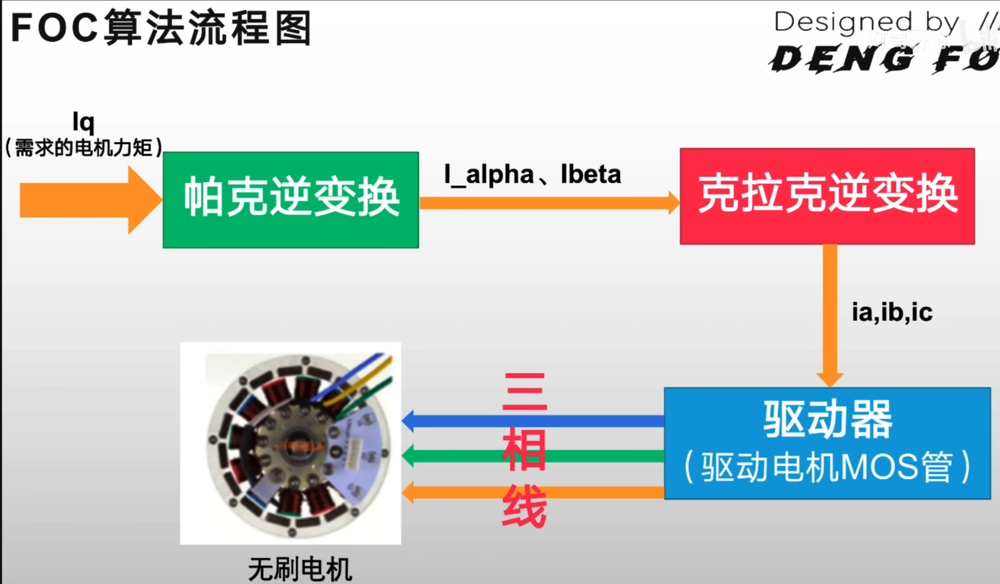
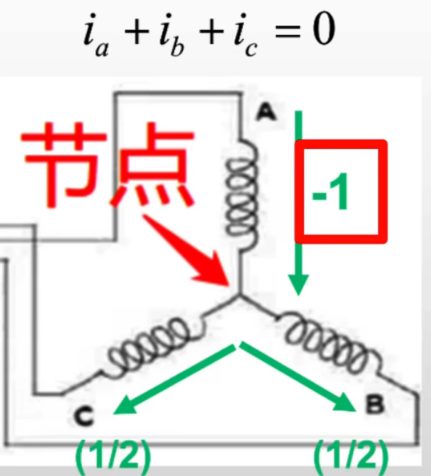
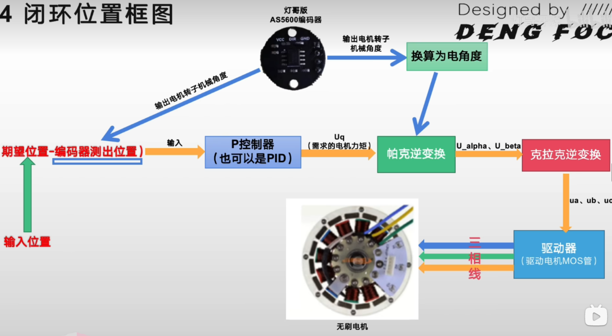
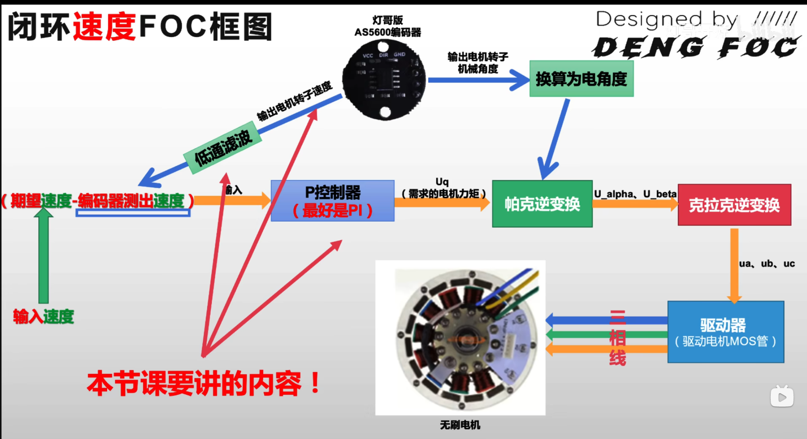
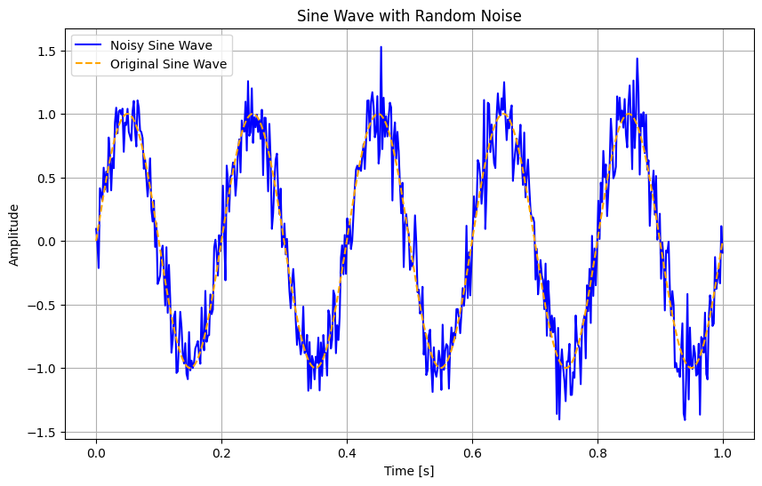
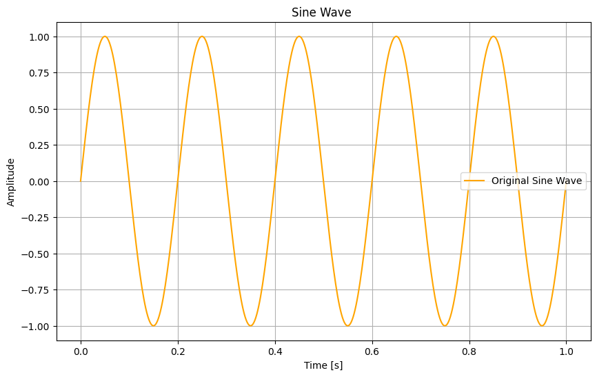
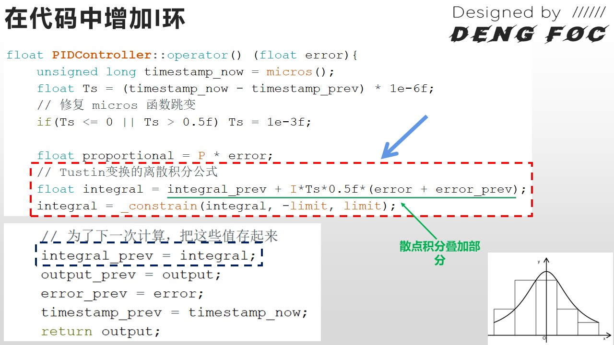
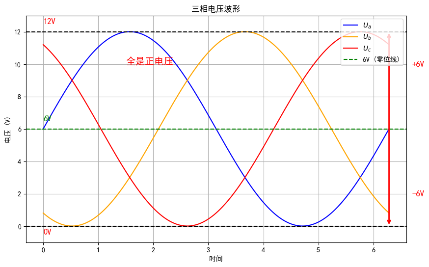
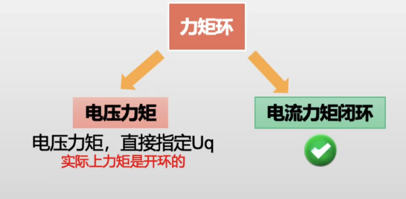

<script src="https://polyfill.io/v3/polyfill.min.js?features=es6"></script>
<script type="text/javascript" id="MathJax-script" async
  src="https://cdn.jsdelivr.net/npm/mathjax@3/es5/tex-mml-chtml.js">
</script>

<!-- vscode-markdown-toc -->
* 1. [1.克拉克变换](#)
	* 1.1. [基本形式](#-1)
	* 1.2. [等幅值变化形式](#-1)
* 2. [2.帕克变换](#-1)
* 3. [2.电角度相关概念](#-1)
	* 3.1. [电角度和机械角度的关系](#-1)
		* 3.1.1. [极对数](#-1)
* 4. [3.控制](#-1)
	* 4.1. [开环代码实现](#-1)
	* 4.2. [闭环控制](#-1)
		* 4.2.1. [1. **比例环节（P环）：**](#P)
		* 4.2.2. [2. **积分环节（I环）：**](#I)
		* 4.2.3. [3. **微分环节（D环）：**](#D)
		* 4.2.4. [4. **PID控制器的总体公式：**](#PID)
		* 4.2.5. [速度闭环](#-1)
		* 4.2.6. [电流闭环](#-1)

<!-- vscode-markdown-toc-config
	numbering=true
	autoSave=true
	/vscode-markdown-toc-config -->
<!-- /vscode-markdown-toc -->
# FOC算法


##  1. <a name=''></a>1.克拉克变换

###  1.1. <a name='-1'></a>基本形式
由于多相位耦合所以无法直接通过控制波形相位以此控制电机。所以我们需要对电机的三相电流进行解耦。

这就引入了第一步：**把三相波形抽象为120°的矢量**，这一步就是为什么高中课堂中要把sin,cos函数的相位变化通过单位圆来去 进行抽象化，同理这里也是在对波形进行抽象化转换为矢量。  

第二步：**矢量投影在$\alpha - \beta$坐标系中**  
$I_{\alpha} = i_a - \sin 30^\circ i_b - \cos 60^\circ i_c$  
进一步化简为：
$$
I_{\alpha} = i_a - \frac{1}{2} i_b - \frac{1}{2} i_c
$$  
针对于 $\alpha - \beta$ 坐标系中的 $\beta$ 轴  
$$
I_{\beta} = \cos 30^\circ i_b - \cos 30^\circ i_c
$$
进一步化简为：
$$I_{\beta} = \frac{\sqrt{3}}{2} i_b - \frac{\sqrt{3}}{2} i_c$$
最后我们就获得了**克拉克变换基本形式**：

$$
\begin{bmatrix}
I_{\alpha} \\
I_{\beta}
\end{bmatrix}
=
\begin{bmatrix}
1 & -\frac{1}{2} & -\frac{1}{2} \\
0 & \frac{\sqrt{3}}{2} & -\frac{\sqrt{3}}{2}
\end{bmatrix}
\begin{bmatrix}
i_a \\
i_b \\
i_c
\end{bmatrix}
$$  
###  1.2. <a name='-1'></a>等幅值变化形式  
  
由于我们在电机的简图中可以看到，在上一节我们抽象化了这个电机中的三相结构，同时我们也发现这个电机结构中出现了一个**霍夫曼电流定律中的节点**，这将会导致A相的电流流入等于B,C相的流出，这样输入到克拉克变换的基本形式矩阵计算出的结果如下公式  
$$
   \begin{bmatrix}
   I_\alpha \\
   I_\beta
   \end{bmatrix}
   =
   \begin{bmatrix}
   1 & -\frac{1}{2} & -\frac{1}{2} \\
   0 & \frac{\sqrt{3}}{2} & -\frac{\sqrt{3}}{2}
   \end{bmatrix}
   \begin{bmatrix}
   -1 \\
   \frac{1}{2} \\
   \frac{1}{2}
   \end{bmatrix}
   =
   \begin{bmatrix}
   1 \times (-1) + \left(-\frac{1}{2}\right) \times \frac{1}{2} + \left(-\frac{1}{2}\right) \times \frac{1}{2} \\
   0 \times (-1) + \frac{\sqrt{3}}{2} \times \frac{1}{2} + \left(-\frac{\sqrt{3}}{2}\right) \times \frac{1}{2}
   \end{bmatrix}
   =
   \begin{bmatrix}
   -\frac{3}{2} \\
   0
   \end{bmatrix}
$$  
计算可以看到我们的$I_{\alpha}$的值不等于-1，也就是幅值并不相等，**对基本克拉克变换形式进行幅值等化也就是乘上系数2/3**,如下公式所示
$$
\begin{bmatrix}
I_{\alpha} \\
I_{\beta}
\end{bmatrix}
=
\begin{bmatrix}
\frac{2}{3} & -\frac{1}{3} & -\frac{1}{3} \\
0 & \frac{\sqrt{3}}{2} & -\frac{\sqrt{3}}{2}
\end{bmatrix}
\begin{bmatrix}
i_a \\
i_b \\
i_c
\end{bmatrix}
$$
最后我们总结以下等幅值变化的公式和具体用法  
公式：  
正变换 
$$
\begin{bmatrix}
I_{\alpha} \\
I_{\beta}
\end{bmatrix}
=
\frac{2}{3}
\begin{bmatrix}
1 & -\frac{1}{2} & -\frac{1}{2} \\
0 & \frac{\sqrt{3}}{2} & -\frac{\sqrt{3}}{2}
\end{bmatrix}
\begin{bmatrix}
i_{a} \\
i_{b} \\
i_{c}
\end{bmatrix}
$$  
逆变换
$$
\left\{
\begin{aligned}
i_{a} &= I_{\alpha} \\
i_{b} &= \frac{\sqrt{3}I_{\beta} - I_{\alpha}}{2} \\
i_{c} &= \frac{-I_{\alpha} - \sqrt{3}I_{\beta}}{2}
\end{aligned}
\right.
$$

**基于基尔霍夫电流定律和克拉克变换我们只需要知道两相电流就能够求解另外一相，省去了一路的电流传感**  
  
##  2. <a name='-1'></a>2.帕克变换
由于我们仍旧无法描述电机的旋转状态，所以我们要引入q-d坐标系来对$\alpha - \beta$坐标系进行映射，从而是的能够使用q-d坐标系上q,d的值去描述电机的旋转状态     
我们同时引入了电角度θ这个概念，同时我们要注意这个**θ并不是在描述转子的机械转动角度**

现在我们来探究以下帕克变换的数学推导  
**正**：
$$
\begin{bmatrix}
i_d \\
i_q 
\end{bmatrix}
=
\begin{bmatrix}
\cos{\theta} & \sin{\theta} \\
-\sin{\theta} & \cos{\theta}
\end{bmatrix}
\begin{bmatrix}
i_{\alpha} \\
i_{\beta} 
\end{bmatrix}
$$

**逆**：
$$
\begin{bmatrix}
i_{\alpha} \\
i_{\beta} 
\end{bmatrix}
=
\begin{bmatrix}
\cos{\theta} & \sin{\theta} \\
-\sin{\theta} & \cos{\theta}
\end{bmatrix}^{-1}
\begin{bmatrix}
i_d \\
i_q 
\end{bmatrix}
$$

拆分：
$$
i_{\alpha} = i_d \cos{\theta} - i_q \sin{\theta}
$$

$$
i_{\beta} = i_q \cos{\theta} + i_d \sin{\theta}
$$
我们可以看出其实就是普通的一个重映射，通过测量电角度我们就可以将电机的旋转状态转换为用于控制电机的电流，让我们来具体使用流程看一下这个过程。  
  
**这就是FOC算法控制的具体流程**

##  3. <a name='-1'></a>2.电角度相关概念
###  3.1. <a name='-1'></a>电角度和机械角度的关系
**电角度=机械角度 * 极对数**
####  3.1.1. <a name='-1'></a>极对数
**一对磁极就是极对数为1**，磁极分N极和S极，一般是成对出现的  
我们举一个具体的例子来看看为什么电角度不等于机械角度，当为一极电机时，转子转一圈，磁感线相当于切割了一圈，对应一个sin函数的一个周期，那么时多极电机的情况，，一个转子的旋转周期不变，但是由于极对数的增加，原本的一个周期内赛下了两段具有完整周期的sin函数，对应的产生的电能也增加了一倍!也就是相当于缩短了发电周期

      电角度的作用：
      电角度在 FOC（Field Oriented Control）控制中尤为重要，因为它直接影响到电机的定子电流与磁场的对齐，从而确保电机产生的电磁力矩最大化。
      电角度是 FOC 算法中用来计算 Clarke 和 Park 变换的关键参数，通过它来确定电机当前的工作状态。
##  4. <a name='-1'></a>3.控制
###  4.1. <a name='-1'></a>开环代码实现

```C++
#include <arduino>
//PWM输出引脚定义
int pwmA = 32;
int pwmB = 33;
int pwmC = 25;

//初始变量及函数定义
#define _constrain(amt,low,high) ((amt)<(low)?(low):((amt)>(high)?(high):(amt)))
//宏定义实现的一个约束函数,用于限制一个值的范围。
//具体来说，该宏定义的名称为 _constrain，接受三个参数 amt、low 和 high，分别表示要限制的值、最小值和最大值。该宏定义的实现使用了三元运算符，根据 amt 是否小于 low 或大于 high，返回其中的最大或最小值，或者返回原值。
//换句话说，如果 amt 小于 low，则返回 low；如果 amt 大于 high，则返回 high；否则返回 amt。这样，_constrain(amt, low, high) 就会将 amt 约束在 [low, high] 的范围内。
float voltage_power_supply=12.6;
float shaft_angle=0,open_loop_timestamp=0;
float zero_electric_angle=0,Ualpha,Ubeta=0,Ua=0,Ub=0,Uc=0,dc_a=0,dc_b=0,dc_c=0;


void setup() {
// put your setup code here, to run once:
Serial.begin(115200);
//PWM设置
pinMode(pwmA, OUTPUT);
pinMode(pwmB, OUTPUT);
pinMode(pwmC, OUTPUT);
ledcAttachPin(pwmA, 0);
ledcAttachPin(pwmB, 1);
ledcAttachPin(pwmC, 2);
ledcSetup(0, 30000, 8);  //pwm频道, 频率, 精度
ledcSetup(1, 30000, 8);  //pwm频道, 频率, 精度
ledcSetup(2, 30000, 8);  //pwm频道, 频率, 精度
Serial.println("完成PWM初始化设置");
delay(3000);

}

// 电角度求解
float _electricalAngle(float shaft_angle, int pole_pairs) {
return (shaft_angle * pole_pairs);
}

// 归一化角度到 [0,2PI]
float _normalizeAngle(float angle){
float a = fmod(angle, 2*PI);   //取余运算可以用于归一化，列出特殊值例子算便知
return a >= 0 ? a : (a + 2*PI);  
//三目运算符。格式：condition ? expr1 : expr2 
//其中，condition 是要求值的条件表达式，如果条件成立，则返回 expr1 的值，否则返回 expr2 的值。可以将三目运算符视为 if-else 语句的简化形式。
//fmod 函数的余数的符号与除数相同。因此，当 angle 的值为负数时，余数的符号将与 _2PI 的符号相反。也就是说，如果 angle 的值小于 0 且 _2PI 的值为正数，则 fmod(angle, _2PI) 的余数将为负数。
//例如，当 angle 的值为 -PI/2，_2PI 的值为 2PI 时，fmod(angle, _2PI) 将返回一个负数。在这种情况下，可以通过将负数的余数加上 _2PI 来将角度归一化到 [0, 2PI] 的范围内，以确保角度的值始终为正数。
}


// 设置PWM到控制器输出
void setPwm(float Ua, float Ub, float Uc) {

// 计算占空比
// 限制占空比从0到1
dc_a = _constrain(Ua / voltage_power_supply, 0.0f , 1.0f );
dc_b = _constrain(Ub / voltage_power_supply, 0.0f , 1.0f );
dc_c = _constrain(Uc / voltage_power_supply, 0.0f , 1.0f );

//写入PWM到PWM 0 1 2 通道
ledcWrite(0, dc_a*255);
ledcWrite(1, dc_b*255);
ledcWrite(2, dc_c*255);
}

void setPhaseVoltage(float Uq,float Ud, float angle_el) {
angle_el = _normalizeAngle(angle_el + zero_electric_angle);
// 帕克逆变换
Ualpha =  -Uq*sin(angle_el); 
Ubeta =   Uq*cos(angle_el); 

// 克拉克逆变换
Ua = Ualpha + voltage_power_supply/2;
Ub = (sqrt(3)*Ubeta-Ualpha)/2 + voltage_power_supply/2;
Uc = (-Ualpha-sqrt(3)*Ubeta)/2 + voltage_power_supply/2;
setPwm(Ua,Ub,Uc);
}


//开环速度函数
float velocityOpenloop(float target_velocity){
unsigned long now_us = micros();  //获取从开启芯片以来的微秒数，它的精度是 4 微秒。 micros() 返回的是一个无符号长整型（unsigned long）的值

//计算当前每个Loop的运行时间间隔
float Ts = (now_us - open_loop_timestamp) * 1e-6f;

//由于 micros() 函数返回的时间戳会在大约 70 分钟之后重新开始计数，在由70分钟跳变到0时，TS会出现异常，因此需要进行修正。如果时间间隔小于等于零或大于 0.5 秒，则将其设置为一个较小的默认值，即 1e-3f
if(Ts <= 0 || Ts > 0.5f) Ts = 1e-3f;


// 通过乘以时间间隔和目标速度来计算需要转动的机械角度，存储在 shaft_angle 变量中。在此之前，还需要对轴角度进行归一化，以确保其值在 0 到 2π 之间。
shaft_angle = _normalizeAngle(shaft_angle + target_velocity*Ts);
//以目标速度为 10 rad/s 为例，如果时间间隔是 1 秒，则在每个循环中需要增加 10 * 1 = 10 弧度的角度变化量，才能使电机转动到目标速度。
//如果时间间隔是 0.1 秒，那么在每个循环中需要增加的角度变化量就是 10 * 0.1 = 1 弧度，才能实现相同的目标速度。因此，电机轴的转动角度取决于目标速度和时间间隔的乘积。

// 使用早前设置的voltage_power_supply的1/3作为Uq值，这个值会直接影响输出力矩
// 最大只能设置为Uq = voltage_power_supply/2，否则ua,ub,uc会超出供电电压限幅
float Uq = voltage_power_supply/3;

setPhaseVoltage(Uq,  0, _electricalAngle(shaft_angle, 7));

open_loop_timestamp = now_us;  //用于计算下一个时间间隔

return Uq;
}


void loop() {
// put your main code here, to run repeatedly:
   velocityOpenloop(5);
}

```
```c++
float _normalizeAngle(float angle)
```
事实上，电角度在 [0, 2π] 之间是周期性的，θ 和 θ + 2πn（其中 n 是整数）所指示的空间位置是相同的。角度归一化操作是通过取模2π来完成的，这只是去除多余的2π周期，对角度的实际物理位置没有任何影响。

      例如，对于一个极对数为 4 的电机，机械角度变化 90° 时，电角度会变化 2π（360°），在这种情况下，电角度从 0 到 2π 覆盖了一个完整的周期。

###  4.2. <a name='-1'></a>闭环控制
在上面我们介绍了FOC的控制算法的流程，但是具体到闭环控制时，我们需要一个机制来在电机处于非设置位置的一种纠正方式，我们就引用了**PID控制算法**。 

####  4.2.1. <a name='P'></a>1. **比例环节（P环）：**
- **功能：** 
  比例控制是根据当前误差值（设定值与实际输出值之间的差值）进行控制。比例控制器输出与误差值成正比。比例控制器的作用是通过立即响应误差来调整控制输出，以使系统输出跟随设定值。
- **公式：** 
  $$
  P_{\text{out}} = K_p \times e(t)
  $$
  其中，$K_p$ 是比例增益，$e(t)$ 是当前时刻的误差。
- **影响：**
  增大比例增益 $K_p$ 会使系统响应更快，但同时可能导致系统产生较大的振荡或不稳定。较低的 $K_p$ 会使系统反应迟缓。

####  4.2.2. <a name='I'></a>2. **积分环节（I环）：**
- **功能：** 
  积分控制通过累积误差来消除稳态误差。即使在系统达到稳态时，如果有持久的小误差，积分控制器将继续调整输出直到误差消除为止。
- **公式：** 
  $$
  I_{\text{out}} = K_i \times \int_{0}^{t} e(\tau) \, d\tau
  $$
  其中，$K_i$ 是积分增益，$e(\tau)$ 是从初始时间 $0$ 到当前时间 $t$ 的累积误差。
- **影响：**
  积分控制可以消除稳态误差，但过大的积分增益 $K_i$ 可能会引入振荡和过冲现象，甚至导致系统不稳定。

####  4.2.3. <a name='D'></a>3. **微分环节（D环）：**
- **功能：** 
  微分控制通过预测误差的变化趋势来改善系统的动态响应。它的作用是提前进行调整，从而减少响应时间和过冲。
- **公式：** 
  $$
  D_{\text{out}} = K_d \times \frac{de(t)}{dt}
  $$
  其中，$K_d$ 是微分增益，$\frac{de(t)}{dt}$ 是误差的变化率。
- **影响：**
  增大微分增益 $K_d$ 可以减少系统的振荡和过冲，提升系统的稳定性和响应速度。但如果噪声较大，微分控制容易放大噪声，导致系统不稳定。

####  4.2.4. <a name='PID'></a>4. **PID控制器的总体公式：**
综合比例、积分、微分控制环节，PID控制器的输出可以表示为：
$$
u(t) = K_p \times e(t) + K_i \times \int_{0}^{t} e(\tau) \, d\tau + K_d \times \frac{de(t)}{dt}
$$
其中，$u(t)$ 是

  
如图就是使用编码器检测出电机位置的变换流程图，输入过程前采用了PID算法的纠正机制。为什么说是位置闭环呢，因为传感器检测只有电机转动的位置信息，接下来我们药感应转子的速度信息，产生速度闭环

####  4.2.5. <a name='-1'></a>速度闭环
 
为了实现速度闭环，我们要搞明白闭环的的本质是什么，本质就是输出的结果能够放过来影响输入，**也就是转子的实际速度对系统的反馈结果**。
那么我们对速度进行闭环首要的就是要测量转子的实际速度，这里是通过编码器测试出当前时刻的角度值与上一时刻角度值的差值并除于间隔时间，获得一个离散的速度值。  
那么这个离散的速度值直接输入到我们的FOC控制系统中就会产生问题，我们的FOC控制系统是一个全反应控制，反应在会对每个毛刺信号做出反应，所以我们需要通过引入滤波器，让FOC控制器只对平滑信号进行反应  
  
**这就是通过低通滤波之后的效果，反应到具体实现中就是电机不会产生奇怪的噪音，也就是产生复杂的震动**
  
那么在完成低通滤波之后，原本的纠偏处理只采用了P环，这是足够的嘛，我们来思考一下  

P环本质上是对误差进行比例修正，他就像是线性的不随着误差存在的时间而增加的，反应到物理意义上就是不随着负载的增加而产生更大力矩快速纠偏，甚至无法完成指定目标的纠偏。  
而I环则能过通过在误差存在时间下积分，存在时间越大，积分出来的结果就会更大，反应到物理意义上就是随着负载增大，会给出更大的力矩来完成纠偏。


####  4.2.6. <a name='-1'></a>电流闭环
在之前的闭环中我们是如何设置力矩的呢？我们是使用理想的$U_{qmax}$并通过PID中的P环和I环以这个假设的$U_{qmax}$进行纠偏如下图所示  
  
  

那么实际上的$U_{qmax}$是真实稳定在6v吗？我想答案是否定的，那么电流闭环就是在前面速度闭环的前提下将速度环下一个环节电压力矩环进行闭环，从而达到更加高的精度。  
  

      误差产生的原因
      电机发热导致的电阻增大而导致电流减小，不进行闭环检测出力矩电流的具体最大值就会导致实际看起来力矩发生了衰减
 

这样对内环中原本电压力矩环进行替换就能够更准确的控制电机和纠正机制  

我们可以看到在进行电压力矩环处理前先进行了电流力矩环的闭环的结算，通过电流力矩环的闭环我们可以限制pid输出的$i{q}$从而限制电机输出的力矩，这就是电流闭环的好处。  
  
同样的在速度闭环（速度-力）的过程中可以通过限制pid的输出$i{q}$能控制控制电机堵转时产生的力矩上限。同时能够通过限定速度，控制电机的旋转速度  

力位位置闭环（位置-力）可以更高效的显示FOC控制。


  
    他人理解补充：
    在我开始研究 foc 的时候，所有的书籍都在介绍 park 变换和 clarke 变换。有一种魔力告诉你，没这俩变换，就写不成 foc.

    然而事实的真相并不是如此。首先得了解，在 foc 发明前，电机是如何控制的？ foc 发明以前，无刷电机采取的是六步换向法。电机每旋转60度，控制器就要进行一次“电子换向”。控制器输出的，是同一时刻 只有2条线有输出的方波。

    由此，在方波时代，电机控制器要控制的无非就是方波的电压。真的是这样的吗？

    事实上，经常玩航模的童鞋就知道。航模的电调，有一个参数叫“换向提前角”。电调会在本不是换向的时间提前换向。
    为何要提前换向呢？转子还没到该换向的位置，为何要提前换向呢？

    如果这个问题没有搞明白，是无法理解 foc 的。

    foc 之所以需要电流采样，本质上就是为了确定提前换向角。而不是像航模的电调那样还得人工配置。为啥要提前换向呢？

    因为磁场是电流建立的，不是电压建立的。而绕组是一个电感。电感的电流会滞后电压。准时换向，不过是让电压和转子呈 90度角度。而电流滞后，会导致电流并不和转子呈90度，也就是磁场没有和转子呈90度夹角，也就是扭矩没有最大化发挥。

    要最大化发挥电机的扭矩，要磁场垂直于转子，电压就必须有一定的提前量。这个提前量，就只能通过对电流的采样获取。前人为啥要进行 park/clark 变换
    教材上说，是为了将三相变两相。因为两相少一个变量，好控制。

    其实那都是教材不懂装懂瞎说的。三相电流本来就只有2个属性。幅值和相位。这个幅值，说的是他完整周期内的最大值。

    但是，最大值，一个周期里只出现2次。也就是说，在某个采样的瞬间，你拿到的，大概率都只是中间的某个值。难道要连续采样一个完整周期才才能确定最大值吗？

    不能。

    那如何能在采样的瞬间，就能直接知晓最大值和相位呢？

    前人的答案之一，就是 逆 clark 变换 + 逆 park 变换。

    其实这种变换，本应该局限于电流采样的时候。 获得电流滞后角后就可以在输出的时候直接修正。输出的地方根本不用进行任何变换。 但是前人为了自己代码编写起来方便，而采取了全程使用 d q 轴。并不是只能这么做，而是当时的前人这么做了。
         