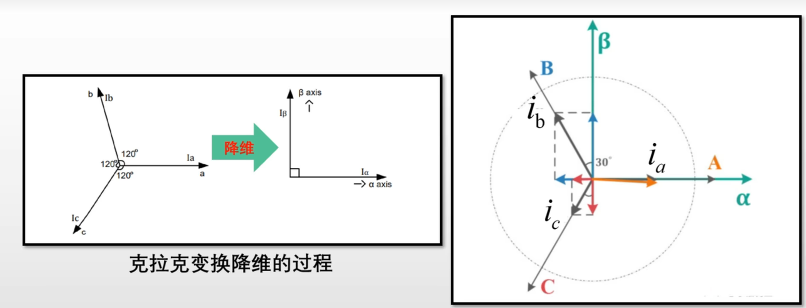
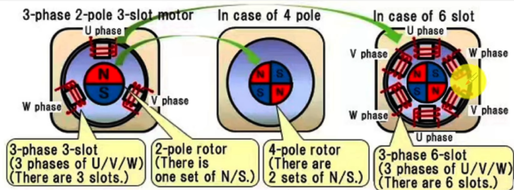
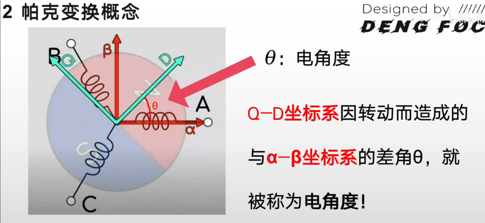

<script src="https://polyfill.io/v3/polyfill.min.js?features=es6"></script>
<script type="text/javascript" id="MathJax-script" async
  src="https://cdn.jsdelivr.net/npm/mathjax@3/es5/tex-mml-chtml.js">
</script>

# FOC 坐标变换

FOC 的核心思想是把三相交流电机的控制问题，等价成一个直流电机的控制问题。实现这一等价的工具正是**坐标变换链**：

```
三相静止 (a,b,c)
    ↓ Clarke 变换
两相静止 (α,β)
    ↓ Park 变换
旋转坐标系 (d,q)
```

d 轴与转子磁通方向对齐，q 轴超前 90°。在 dq 系中，Id 控制磁通，Iq 控制转矩，两者解耦，各自用一个 PI 独立调节——这正是"直流化"的含义。

---

## 一、Clarke 变换（三相 → 两相静止）

### 1.1 物理直觉

三相绕组轴线互差 120°，把三个相量投影到正交的 α-β 平面，就得到了一个等效的二维旋转矢量。



把三相电流视为在空间中互差 120° 的矢量，对 α 轴（与 a 轴重合）投影：

$$
I_{\alpha} = i_a - \sin 30^\circ \cdot i_b - \sin 30^\circ \cdot i_c = i_a - \frac{1}{2}i_b - \frac{1}{2}i_c
$$

对 β 轴（超前 α 轴 90°）投影：

$$
I_{\beta} = \cos 30^\circ \cdot i_b - \cos 30^\circ \cdot i_c = \frac{\sqrt{3}}{2}i_b - \frac{\sqrt{3}}{2}i_c
$$

### 1.2 基本矩阵形式

$$
\begin{bmatrix} I_{\alpha} \\ I_{\beta} \end{bmatrix}
=
\begin{bmatrix}
1 & -\dfrac{1}{2} & -\dfrac{1}{2} \\[6pt]
0 & \dfrac{\sqrt{3}}{2} & -\dfrac{\sqrt{3}}{2}
\end{bmatrix}
\begin{bmatrix} i_a \\ i_b \\ i_c \end{bmatrix}
$$

### 1.3 等幅值（2/3 系数）形式

基本形式在三相对称条件下存在幅值缩放（输出幅值为输入的 3/2 倍），需乘以 2/3 修正：

$$
\begin{bmatrix} I_{\alpha} \\ I_{\beta} \end{bmatrix}
=
\frac{2}{3}
\begin{bmatrix}
1 & -\dfrac{1}{2} & -\dfrac{1}{2} \\[6pt]
0 & \dfrac{\sqrt{3}}{2} & -\dfrac{\sqrt{3}}{2}
\end{bmatrix}
\begin{bmatrix} i_a \\ i_b \\ i_c \end{bmatrix}
$$

**验证**：三相对称时 $i_a = -1,\ i_b = i_c = \frac{1}{2}$，代入等幅值形式得 $I_\alpha = -1$，幅值一致 ✓

### 1.4 等功率形式（能量守恒）

若要求变换前后功率不变，系数改为 $\sqrt{2/3}$：

$$
\begin{bmatrix} I_{\alpha} \\ I_{\beta} \end{bmatrix}
=
\sqrt{\frac{2}{3}}
\begin{bmatrix}
1 & -\dfrac{1}{2} & -\dfrac{1}{2} \\[6pt]
0 & \dfrac{\sqrt{3}}{2} & -\dfrac{\sqrt{3}}{2}
\end{bmatrix}
\begin{bmatrix} i_a \\ i_b \\ i_c \end{bmatrix}
$$

> **工程实践**：FOC 控制器通常使用**等幅值形式**；电机模型与参数辨识中常用等功率形式。两种形式混用会导致 PI 参数与电机参数不匹配。

### 1.5 逆 Clarke 变换

由基尔霍夫电流定律 $i_a + i_b + i_c = 0$，只需采样两相即可重建三相：

$$
\left\{
\begin{aligned}
i_a &= I_{\alpha} \\
i_b &= \dfrac{-I_{\alpha} + \sqrt{3}\,I_{\beta}}{2} \\
i_c &= \dfrac{-I_{\alpha} - \sqrt{3}\,I_{\beta}}{2}
\end{aligned}
\right.
$$

---

## 二、电角度与极对数

Park 变换依赖电角度 θ，必须先理解它的来源。

### 2.1 机械角度 vs 电角度

$$
\boxed{\theta_e = p \cdot \theta_m}
$$

其中 $p$ 为**极对数**（一对 N-S 磁极 = 1 个极对），$\theta_m$ 为机械转角，$\theta_e$ 为电角度。

**直觉**：4 极对数电机转子转过 90° 机械角，定子绕组切割了一整个磁极对的磁感线，对应电角度走完了 360°（一个完整电周期）。极对数越多，同样转速产生的电频率越高，发出的感应电动势也成倍增加。



### 2.2 电角度的作用

- **Park/Clarke 变换的输入**：变换矩阵中的 θ 必须是电角度，否则 dq 轴无法与转子磁通对齐
- **换向提前角的本质**：电感绕组中电流滞后电压，要使磁场与转子保持 90° 最优角（最大转矩），电压矢量须提前换向——这个提前量正是通过实时电角度计算的

---

## 三、Park 变换（两相静止 → 旋转 dq 系）

### 3.1 几何含义

α-β 坐标系固定在定子上，dq 坐标系跟随转子旋转（转速 = 电角速度 ω）。Park 变换就是把静止坐标系中的旋转矢量，投影到随之同步旋转的坐标系中，变成直流量。



### 3.2 正变换矩阵

$$
\begin{bmatrix} i_d \\ i_q \end{bmatrix}
=
\underbrace{\begin{bmatrix} \cos\theta & \sin\theta \\ -\sin\theta & \cos\theta \end{bmatrix}}_{旋转矩阵\,R(\theta)}
\begin{bmatrix} I_{\alpha} \\ I_{\beta} \end{bmatrix}
$$

这本质是将矢量 $(I_\alpha, I_\beta)$ 旋转 $-\theta$ 角，使其与 dq 轴对齐。

### 3.3 逆 Park 变换

$$
\begin{bmatrix} V_{\alpha} \\ V_{\beta} \end{bmatrix}
=
\begin{bmatrix} \cos\theta & -\sin\theta \\ \sin\theta & \cos\theta \end{bmatrix}
\begin{bmatrix} V_d \\ V_q \end{bmatrix}
$$

展开为：

$$
V_\alpha = V_d\cos\theta - V_q\sin\theta, \quad V_\beta = V_d\sin\theta + V_q\cos\theta
$$

---

## 四、完整 FOC 坐标变换链

### 4.1 反馈路径（电流采样 → dq 电流）

```
采样 ia, ib  →  [Clarke]  →  Iα, Iβ  →  [Park(θ)]  →  Id, Iq
```

### 4.2 控制输出路径（dq 电压 → PWM）

```
PI 输出 Vd, Vq  →  [逆Park(θ)]  →  Vα, Vβ  →  [SVPWM]  →  占空比 Ta,Tb,Tc
```

### 4.3 简化开环实现（Arduino/ESP32）

```cpp
void setPhaseVoltage(float Uq, float Ud, float angle_el) {
    angle_el = _normalizeAngle(angle_el + zero_electric_angle);

    // 逆 Park 变换（Id=0 时 Ud=0，简化为）
    float Ualpha = -Uq * sin(angle_el);
    float Ubeta  =  Uq * cos(angle_el);

    // 逆 Clarke 变换（直接计算三相电压）
    float Ua = Ualpha + voltage_power_supply / 2;
    float Ub = (sqrt(3.0f) * Ubeta - Ualpha) / 2 + voltage_power_supply / 2;
    float Uc = (-Ualpha - sqrt(3.0f) * Ubeta) / 2 + voltage_power_supply / 2;

    setPwm(Ua, Ub, Uc);
}

// 电角度归一化到 [0, 2π]
float _normalizeAngle(float angle) {
    float a = fmod(angle, 2 * PI);
    return a >= 0 ? a : (a + 2 * PI);
}

// 电角度 = 机械角度 × 极对数
float _electricalAngle(float shaft_angle, int pole_pairs) {
    return shaft_angle * pole_pairs;
}
```

---

## 五、FOC 变换的深层理解

> 以下是一位工程师的视角补充，揭示了教材背后的工程本质：

教材通常说 Park/Clarke 变换是"把三相变两相"，实际的核心目的是：**在任意采样瞬间，能从两个电流采样点直接推算出电流矢量的幅值和相位**。

三相电流有两个自由度（幅值和相位），理论上用两路采样就能完全确定。但采样的瞬时值是某个时刻的截面，无法直接知道它属于哪个周期的哪个位置。Clarke 变换（把 abc 投影到 αβ）加上 Park 变换（把旋转的 αβ 矢量锁定到 dq 轴），等效于"解调"——把以电频率旋转的电流矢量变换成静止的 DC 分量 Id 和 Iq，使 PI 控制器能对其进行稳态调节。

**提前换向角的来源**：PMSM 绕组是电感，电流滞后电压。若不补偿，实际电流矢量会落后于期望位置，转矩下降。FOC 通过实时采样 → Clarke → Park → PI 输出 Vd/Vq → 逆 Park，自动把电压矢量的相位提前，补偿了电感引起的电流滞后，使磁场始终与转子保持 90° 最优夹角。

---

## 参考资料

- [SimpleFOC - 坐标变换实现](https://docs.simplefoc.com/theory_corner)
- [MATLAB Clarke/Park 变换文档](https://www.mathworks.com/discovery/clarke-transformation.html)
- [Switchcraft - SVPWM 与 Park 变换图解](https://www.switchcraft.org/learning/2017/3/15/space-vector-pwm-intro)
